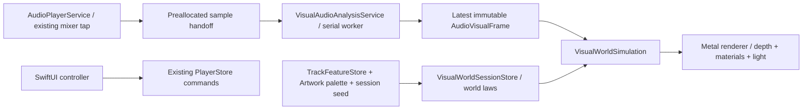

# Visual World — Beta 3 / Installation Art Direction

> 造形の方向はユーザー指示で撤回し、[Photon Sphere](NowPlayingVisualWorld-PhotonSphere.md)へ変更。以下の幾何構造・枠面・弧は現在の画面には存在しない。音声解析・操作・負荷制御は引き継ぐ。

## 0. この文書の位置づけ

**音楽が力となり、光と物質が時間をかけて応答する、巨大な空間作品。iPhoneはその空間を覗く窓である。**

ユーザーの「Installation Art Direction」と添付「Art Direction Redesign」を統合した設計案。現在の[Beta 2仕様](NowPlayingVisualWorld.md)と実コードを調査したうえで、作品の構成と実装方針を定める。本文のクラス名、数値、時間、予算は実装前の提案・調整開始値であり、実測結果や完成を表さない。以下に設計目標と初回実装の対応を記録する。設計中の数値を実測値と混同しない。

鑑賞体験の優先順位は **音楽再生の安定 → 意図した操作 → 空間の構成と光 → 装飾の密度**。視覚の負荷によって音源の品質、EQ、音量補正、キュー、再生履歴を変更しない。テーマの保存ID、通常再生画面、作業用画面も既存の役割を保つ。

## 初回実装の到達点（2026-09-16）

- **描画**：Metal + MTKViewへ接続。4枚以下の巨大構造を共通のray／surface交差で描画し、遮蔽、1面の反射、内部・縁のスペクトラム発光、膜の透過近似、背景の光、少量の粒子、HDR発光とbloom／tone mappingを実装。Auroraは曲面帯、Neonは角形の枠面、Cosmosは欠損した弧、Simple Darkは2構造に限定。Metal初期化失敗時はBeta 2 Canvasへfallback。
- **音声入力**：既存出力tapを共有。追加部分は事前確保mailboxへの有界copyのみで、満杯なら視覚sampleをdrop。短いtap bufferは蓄積。別queueの20Hz解析で左右別のFFT powerを合算し、24対数帯域、low／mid／high、flux、調波combの音域位置とconfidenceを生成する。既存32区間ビジュアライザー表示の意味は変更しない。
- **音程感**：4調波の重み付きsalienceを用いる表示上の推定。正確な音名、旋律、調性の認識ではない。打楽器／多声音楽での精度は実曲確認が必要。
- **運動**：energy／aggressive／calm／ambient／drumAndBass／electronic／piano／tempoによる力、可動域、拘束、減衰。音域、左右情報と組み合わせ、蓄積→解放→回復を積分する。停止後は最大約10秒で描画休止。画面非表示・非activeでは追加解析と時計を停止する。
- **配色と変奏**：Artworkの主色・副色・accentと色の占有率、無彩色fallback。発光／吸収への役割分配。セッションseedはPlayerStoreが保持し、pause／seek／画面切り替えで再生成しない。曲開始時の姿勢と配色は補間する。
- **負荷制御**：標準30fps、低電力／コントローラー表示20fps、thermal serious時15fps、critical時静止。通常0.9MP／低品質0.45MP上限の描画target。低品質では反射rayを省略し、粒子を減らす。GPU処理中frameは最大2、満杯なら待たずにdrop。熱からの復帰は30秒待つ。
- **既存操作**：通常画面への切り替え、小さいArtworkと曲情報、背景操作によるコントローラー表示、0.85秒長押しを維持。常時説明文は小さいellipsisへ整理。

### 設計目標との差分と未検証項目

初回実装のFFTは2,048点固定（sample rateは実値を使用）。高sample rateでの低域分解能、適応窓長は今後の検証対象。光学効果は限定した近似であり、完全な物理光学、複数回反射、history textureによる残像、5色すべての独立cluster抽出、音名追跡は未実装。余韻はSimulationの保持したエネルギーから描く。描画予算表は目標であり、iPhone実機の15分連続再生・熱・Bluetooth同期の評価は未実施。

### 実施した確認

- 汎用iOS Simulator destinationでアプリ／Watchをbuild成功。Metalコンパイラが環境に無かったためXcode公式Metal Toolchainを追加。署名・SDK設定・AppIcon・Deployment Targetは変更していない。
- `scripts/check-visual-world.sh`で実ソースに対するmacOS XCTest 10件成功。周波数帯、逆相、4 sample rate、無音、mailbox overflow／短いbuffer、強い運動の上限、休止、欠測／不正値を確認。iOSの全test suiteは未実行。
- Mac GPUで4テーマ×2状態を描画。20秒の合成入力動画を作り、静穏・解放・余韻のframeを目視確認。実曲・iPhoneの体験確認の代替とはしない。

## 0.1 改訂の中心 — SPECTRAL FOLD / 光が構造を折り変える

作品の核を **「巨大な幾何構造の中にスペクトラム光が閉じ込められ、音の力で構造が開くたび、空間全体の反射が組み替わる」** とする。これは制作上の仮題であり、アプリに新しいテーマ名を増やすものではない。

第一案の「ゆっくり漂う背景」から、**大きな構図変化を持つ運動する彫刻**へ改訂する。静かな区間は張力を蓄える。強い曲では、巨大な面が画面を横断し、奥の構造が露出し、発光と反射が別方向へ走る。最大運動量を小さい揺れに制限しない。音楽が要求する区間では、画面の大部分が明確に動く。

### 決定する構図

- **主構造**：画面の外まで伸びる3〜5枚の巨大な枠面。正面の同心図形ではなく、傾斜・厚み・欠損を持つ。輪郭だけでなく、光を遮る幅のある面を描く。
- **視点**：構造の外観を鑑賞する位置ではなく、面と面の間に入った位置。前景の縁が左右または上辺で切れ、奥にもう一つの開口が見える。
- **焦点**：画面中央から外した接合部に置く。発光の焦点は通常1か所、反射の焦点は最大2か所。視線が「発光源→反射面→奥の開口」へ移動する。
- **暗部**：通常は画面の約半分を構造の影と奥行きに使う。解放時にも暗い輪郭を残し、動いた面の方向を読めるようにする。割合は構図試験の目安。
- **スペクトラム**：枠の内面を連続した光の密度として走る。帯域ごとの縞の太さ、鮮明さ、広がりが変わり、反射先で伸長・分離する。均等なバー配列にしない。
- **反射**：光源と同じ絵の薄い複製にしない。面の角度、粗さ、遮蔽で形を変え、主構造が開いた瞬間に見えていなかった反射が現れる。

### 作品を成立させる一つの出来事

細い発光だけが巨大な枠の存在を示している。低域が持続すると奥の枠がねじれ、隙間の光が太くなる。音程感が上へ動くにつれて光の集中位置が接合部を登る。強いアタックで一枚の面が大きく開き、画面幅を横断する反射が手前を通過する。遅れて奥の枠が回転し、空間の抜ける方向が変わる。入力が弱まっても面は慣性で進み、光だけが先に細くなる。

この因果の連鎖を各テーマの素材へ翻訳する。Auroraは折れる光学膜、Neonは切断された導光構造、Cosmosは張力を持つ巨大な弧。テーマごとに無関係なエフェクト集を作らない。

### 入力は4系統に固定する

| 入力 | 作品へ渡すもの | 決定するもの |
| --- | --- | --- |
| 曲の音楽特徴量 | energy / aggressive / calm / ambient等 | 運動の最大量、質量、拘束、反射の残り方 |
| 既存ビジュアライザーと共通の音声入力 | 同じ再生出力・時刻のlevel、左右情報、スペクトラム用解析 | その瞬間の力、発光分布、散乱、励起 |
| その瞬間の音程感 | 音域の重心、調波の集中、上昇／下降傾向と信頼度 | 光の集中位置、構造の開き方、反射経路の秩序 |
| Artworkのカラーバリエーション | 色clusterと占有率・明度分布 | 発光と反射の色の配分、色の希少性、暗部の色味 |

「ビジュアライザーと同じ」は音声入力と時刻の共有を意味する。現行の32区間ピークには周波数情報がないため、その値をスペクトラムや音程へ読み替えない。周波数解析を一つの共通の表示用サービスへ置く案とし、既存ビジュアライザーの表示仕様変更は別途明示する。二重tapや別々の解析clockを増やさない。

### 制作レビューで最初に提出するもの

同一構図の「暗い静止」「張力の蓄積」「最大変位」「反射だけが残る」の4枚と、同じ入力で低強度／最大強度を比較できる20秒のmotion study。質感を足す前に、白黒の面と光だけで巨大さ・運動方向・主従が伝わることを確認する。最終レビューでは実曲3分の連続鑑賞も行う。設計書の形容詞だけで造形の完成判定をしない。

## 1. 現状分析：なぜ「背景の模様」に見えやすいのか

2026-09-16時点のコードを確認した事実と、そこからのアートディレクション上の判断を分ける。

| 現状の実装 | 鑑賞上の問題 | Beta 3での変更 |
| --- | --- | --- |
| `VisualWorldScene`はsin主体の帯、同心の六角形、連続した楕円軌道 | 一度形を理解すると、その後の展開を予測しやすい。完成した小さな図形に見える | 見切れる主構造、遮蔽物、遅い姿勢変化、音の履歴から変わる場を構成する |
| Canvasの加算合成と重ねstrokeが発光の中心 | 光源・物体・反射像の区別が弱く、すべてが同じ発光素材に見える | 不透明な吸収面、透過面、発光する縁、反射を別の材質として扱う |
| Cosmosに簡易遠近計算があるが、共通の深度・遮蔽はない | 手前と奥の因果関係が読み取りにくい | 前景の遮蔽、主構造、遠景の3層を共通のカメラと深度で描く |
| 同じ`level`・`impulse`を複数要素に即座に反映 | 音が大きいと一斉に変わり、「力が伝わった」感覚が薄い | 力 → 表面伝播 → 散乱 → 残光を時間差で連鎖させる |
| 一時停止するとTimelineも即停止 | 空間の質量や慣性より、動画の停止操作を感じる | 画面が見えている間は有限の余韻を残し、休止へ移行する |
| 色はprimary／secondaryの2色 | 環境光・鏡面・内部発光が同じ色になりやすい | 5つの役割を持つArtworkパレットへ再構成する |
| 粒子の配置は固定の整数式、曲ごとのseedはない | 同じテーマでは構図が似通う | 曲の性格と再生セッションのseedで、首尾一貫した変奏を作る |
| `spectrumLevels`は左chを32区間に分けた時間領域ピーク | 周波数帯・音程として解釈できない | 既存表示から分離した、表示専用の周波数解析を設計する |
| 実音から取得する値はlevel／balance／width、特徴量の利用も一部 | low／mid／highやdark／aggressiveなどに異なる仕事がない | 音響入力と曲の特徴を「世界の法則」へ集約する |

ここでいう「アマチュアっぽさ」は線の数や解像度ではなく、主役・材質・距離・時間の役割が十分に分かれていないことを指す。画面全面を明るくするだけでは解決しない。

調査対象：[Scene](../MyMusic/Views/Player/VisualWorldScene.swift)、[Dynamics](../MyMusic/Views/Player/VisualWorldDynamics.swift)、[View](../MyMusic/Views/Player/NowPlayingVisualWorldView.swift)、[PaletteService](../MyMusic/Services/VisualWorldPaletteService.swift)、[AudioPlayerService](../MyMusic/Services/AudioPlayerService.swift)、[TrackFeatureValues](../MyMusic/Models/TrackFeature.swift)。

## 2. 共通の作品思想 — 音に駆動される場

### 2.1 画面内に置くもの

常に「主構造1つ」「その光を受ける構造1つ」「遠方の場」を中心に構成する。粒子は距離や力の方向を伝える補助とする。

- 主構造は画面幅の1.5〜3倍程度を初期目安とし、全体像が一度に収まらない。形を大きく切り取る。
- 前景には暗い縁や面を置き、主構造を部分的に隠す。遠景は低コントラストで、手前より遅く動く。
- 同時に強い動きをする主役は1つ。反射は主役に従い、遠景は遅れて反応する。
- 明るい焦点と深い暗部を共存させる。明るい曲でも全面を白く覆わない。
- 視野・構図は画面サイズから決める。縦長画面を横へ引き伸ばす方式にせず、横長でも同じ空間を別の窓として切り取る。

惑星モデル、星座、数値ラベル、目盛り、スペクトラムバー、等間隔に跳ねる波形、均等な音量リングは置かない。宇宙現象は形の参考に加え、力・距離・時間の振る舞いとして使う。

### 2.2 見えていない空間を感じさせる

巨大さはオブジェクトの拡大だけで作らない。見切れ、遮蔽、遠近の速度差、照射の遅れ、光が届かない面を組み合わせる。主構造の向こうから光が入り、手前の面へ遅れて反射すれば、画面外にも世界が続いていると感じられる。

「重力」「屈折」「干渉」は芸術上のモデルであり、宇宙物理・光学の科学シミュレーション精度を目的にしない。一方で、同じ音が同じ世界で引き起こす因果関係は一貫させる。

### 2.3 音が世界を変える順序

```text
曲の特徴量 + セッションseed → 世界の法則・配置・材質
                                ↓
現在の音 → 力・励起 → 慣性を持つ運動 → 表面の光 → 反射／散乱 → 蓄積／減衰
                                ↓
                      強度に応じたカメラと露出
```

例：低音で重力場が強まる。近くの膜が曲がり、150〜400ms遅れて反射の焦点が移り、さらに粒子の流れが湾曲する。低音に合わせて全要素を同時に拡大する実装にはしない。

## 3. Theme Art Direction Bible

テーマは「作品の材質と構造」を決め、楽曲はその中の「力と時間」を決める。同じ曲を別テーマで見ても音楽との関係が残り、同じテーマで別曲を聴けば世界の安定性と密度が変わる。

### 3.1 Living Aurora — 光を含む巨大な膜

**体験：薄い光の膜の内部を、重力と風がゆっくり通り抜ける。**

| 項目 | 設計 |
| --- | --- |
| 空間 | 遠近の異なる2〜3枚の膜。手前の膜は画面上辺・側辺へ見切れ、背後に深い空洞がある |
| 光 | 内部に蓄えた光が折り目へ集まる。直視する光より、透過と散乱の面積を広くする |
| 材質 | 薄い半透明の光学膜。縁は薄く鋭いが、膜の内部は柔らかい。厚みの差で透過量が変わる |
| ジオメトリ | 広い曲面と不均一な折り目。細い線は膜の内部応力を示す程度に限定する |
| カメラ | ゆっくり横へ漂い、近い膜の縁が遠景に対してずれる。強い区間でも急なロールを行わない |
| 動き | 低域による曲率の変化、中域の内部伝播、高域の縁の分光。安定→張力→緩みの間を移る |
| 反射 | 背面の暗い面に、膜の折り目に対応したぼけた集光像。音の直後でなく変形の結果として動く |
| 粒子 | 微量の浮遊物。膜を貫通して見えないように深度と透過で整理する |
| 色 | dominantを内部、secondaryを背面透過、accentを薄い縁に配分。色相変化より光路の変化を優先 |

**見せ場**：膜の向こうで光が一度蓄積され、折り目の移動に伴って大きな光の帯が画面外へ抜ける。残った面が数秒かけて暗くなる。常時同じsin波を横へ流す構図は避ける。

### 3.2 Pulse Neon — 暗い建築に閉じ込められた光

**体験：画面外へ続く黒い建築物の内部で、光が伝播し反射する。**

| 項目 | 設計 |
| --- | --- |
| 空間 | 巨大な斜めの梁／切断面と、奥にある半透明板。床または片側の面だけが反射を担う |
| 光 | 中域で内部の導光路を走り、高域で切断面から分散して漏れる。発光しない構造も必要 |
| 材質 | 光を吸う黒い面、薄い鏡面の縁、ガラスの内部。全てを同じGlowにしない |
| ジオメトリ | 2〜3の大きな面と非対称な接合部。小さい多角形を等間隔に連ねるトンネルを主役にしない |
| カメラ | 静かなdollyと軽い視差。低域の圧力に対し奥行き方向へ少し押され、慣性で戻る |
| 動き | 梁の姿勢は遅く変わる。光の反射経路は速い。aggressive時だけ局所的に角度が変わり、新しい光路が開く |
| 反射 | 限定した1面の反射。粗さのある黒い面に、光源とは幅と明度が違う像を生む |
| 粒子 | 接合部や縁の励起から少数放出。空間全体の無関係な星にはしない |
| 色 | dominantを導光、secondaryを反射、accentを分散の端、darkを建築面に使う |

**見せ場**：低音で面の角度がわずかに変わり、暗かった奥の面へ光が到達する。反射が数回弱まりながら残る。高強度では梁自体も大きく旋回し、光の到達する場所と画面の構図が同時に変わる。

### 3.3 Blue Cosmos — 見えない質量の周囲

**体験：姿の見えない巨大な質量が、薄い光と物質の流れを曲げ続けている。**

| 項目 | 設計 |
| --- | --- |
| 空間 | 偏心した巨大な欠けた円盤／弧。全周を収めず、中心の一部も画面外へ逃がせる。前景に暗い遮蔽、遠方に低密度の場 |
| 光 | 円盤内部の散乱、薄いコロナ、暗い領域の縁で曲がる遠方の光。恒星の写真は置かない |
| 材質 | 吸収する空洞と、疎密を持つ半透明の流れ。黒い穴を一枚の丸で置いて終わらせない |
| ジオメトリ | 数本の幅を持つ帯と欠損部。均一な28本の輪郭線を主構造にしない |
| カメラ | 偏心した長い公転、非常に小さい姿勢変化、前景と遠景の強い距離差 |
| 動き | 低域で場が強まり、近い流れほど曲がる。遠景は遅れて引かれる。calmは安定した軌道、aggressiveは局所的な離脱 |
| 反射 | 鏡面床は用いない。遠方の光の屈曲と、円盤の手前／奥で異なる透過を中心とする |
| 粒子 | 星座でなく連続した流れの標識。帯へ沿って集まり、軌道を外れた粒子が残光を引く |
| 色 | dominantを散乱光、secondaryを遠景、accentをコロナや局所放出。darkで見えない領域を維持 |

**見せ場**：強い低音で場の中心がずれ、光の弧が数秒かけて大きく湾曲する。高域の入りで細い発光がその弧を走り、粒子が少し遅れて流れへ戻る。ブラックホールの教材や宇宙飛行ゲームの視点にしない。

### 3.4 Simple Dark — 一つの光学的な彫刻

黒の中に大きな面または弧を一つ置く。細い縁の光、少量の反射、長い慣性だけで成立させる。Artworkの色は一色を主とし、accentはごく狭い領域に使う。常時粒子群を追加しない。他テーマの単なる低輝度版ではなく、「何を描かないか」が構成となる。

## 4. 光学的な材質と描画上の対応

以下は光学現象に着想した近似。全ての効果を常時重ねず、テーマごとの主材質に必要なものを選ぶ。

| 現象 | 作品での仕事 | iPhone向け実装案 |
| --- | --- | --- |
| Reflection | 光が構造へ到達したことを伝える | Neonの指定した1面のみ低解像度のplanar reflection。粗さをmip／小さいフィルタで表現 |
| Refraction / dispersion | 膜やガラスに厚みを感じさせる | 背景color textureを法線と厚みで小さくずらしてsample。副色との分離は透過面の端に限定 |
| Diffraction / interference | 薄い縁の色・強度の微細なずれ | 光路差に似せたboundedな位相関数。細かい縞はpixel幅でfilterし、moireを抑える |
| Scattering / volumetric light | 光が空間を通る距離を示す | 主構造の周辺だけの低解像度light volume。固定少数slice／解析的密度を候補とする |
| Bloom | 強く発光した部分の残りを周囲へ広げる | emissionからだけ抽出し、低解像度でblur、合成後にtone map。暗部やUIをぼかさない |
| Caustics | 曲面や膜の変形を受光面へ伝える | 膜の曲率／光路と共有する模様を投影。独立したランダムな光の模様にしない |
| Lensing | 見えない質量を光の曲がりとして感じさせる | 深度／領域maskで限定したbackground UV変形。中心の特異点をsoftenし、画面端のsampleを保護 |
| Afterimage / trail | 音で与えたエネルギーを残す | emissionのみの低解像度history。カメラ移動・曲切替でresetまたは再投影。画面全体を蓄積しない |
| Spectral emission | 音域ごとの異なる材質応答 | 低域は場、中域は内部光、高域は縁と散乱。音域を固定RGB色へ直結しない |

chromatic aberrationは物体の屈折端に限定する。画面全体のRGBずらし、恒常的なグリッチ、全面フラッシュを作風の代わりに使わない。

## 5. Artwork Color System

既存のactorと縮小画像キャッシュを発展させ、画像から取得した色と、そこから生成した役割色を区別する。

| Role | 生成方法 | 主な使用先 |
| --- | --- | --- |
| dominant | 面積と彩度を考慮した代表cluster。黒・白だけで選択を支配させない | 主光源、内部発光 |
| secondary | dominantと知覚的に十分離れた実在cluster | 透過、反射、遠景 |
| accent | 少面積でも明確な色。なければ主色から狭い範囲の補助色を生成 | 光路の端、局所的な放出 |
| dark | 画像の低輝度域を基に、彩度・輝度を抑えて生成 | 吸収面、環境の深さ |
| highlight | dominant／secondaryを白へ寄せる。完全白は小面積 | 鏡面、薄い縁、光の焦点 |

同一色しかない画像で5色を無理に「抽出した」と扱わない。グレースケールは無彩色の彫刻として成立させ、必要な補助光だけテーマfallbackから取る。画像なし・破損・読み込み中も同じ材質設計を保つ。役割色にはsource（extracted／derived／themeFallback）を表示内部の診断値として持たせる。

色clusterの占有率も保存し、色の出現頻度へ使う。広い主色面に対して、Artworkに少量だけある色は強い瞬間の細い反射として現れる。5色を均等に塗り分けない。

計算は縮小画像で一度行う。明度／彩度の上限をかけ、描画はlinear colorで合成してから表示へ変換する。曲変更では2〜4秒かけて役割ごとに色を引き継ぐ。Artwork原画像とUIの文字色は変えない。

## 6. 音響入力：現状・Beta 3必須・研究対象

### 6.1 入力の契約

| 値 | 現状 | Beta 3での扱い |
| --- | --- | --- |
| RMS由来level | 取得済み（sqrtで圧縮済み） | 互換表示用を保持し、新解析は生の左右power／RMSから求める |
| 左右balance | 取得済み | 平滑化して光の偏りへ。カメラを即座に左右へ振らない |
| Stereo width | L-RのRMSと左右RMSからのproxy | 維持可能。物理的な空間幅やSpatial Audio位置とは呼ばない |
| 周波数power、low／mid／high | 未取得 | Beta 3の材質応答に必須。vDSP FFTから求める |
| Spectral centroid / flux | 未取得 | 中心周波数は光の細かさ、fluxは局所的な励起候補。別物として扱う |
| Transient | 短期／長期level差のみ | fluxと振幅立上がりを併用。拍・BPM検出とは区別する |
| 音程感 / tonal tendency | 未取得 | 必須の設計入力。音域と調波の集中、上昇下降の傾向をconfidence付きで光路・構造へ渡す。正確な音名推定は別の研究対象 |
| Harmonic / noise傾向 | 未取得 | flatness等をtextureの補助指標として検討。楽器識別や音源分離と混同しない |
| Semantic features | `TrackFeatureValues`に存在 | 曲全体の法則。瞬間の音域をsemantic scoreで代用しない |

### 6.2 FFTの初期案

Appleの[Accelerateによる周波数成分の計算](https://developer.apple.com/documentation/accelerate/finding-the-component-frequencies-in-a-composite-sine-wave)を基盤候補とする。windowとFFT setup、入出力領域は事前に用意し再利用する。既存の`spectrumLevels`からFFT相当の値を推測しない。

- 実際のtapのsample rateで窓を決める。44.1／48kHzでは2048 samples、88.2／96kHzでは4096、176.4／192kHzでは8192を初期候補とし、およそ40〜50msの分析窓にする。未検証rateでは対応帯域を制限してfallbackする。
- Hann windowを使い、窓のpower補正とFFT正規化をテストで固定する。UIへの新snapshotは最大20Hz、描画は補間する。
- 左右を先に平均してFFTすると逆相で相殺するため、左右power spectrumを別々に求め、powerを合算する。モノラルは1本、2ch超は別方針を確定するまでlevel中心のfallbackとする。
- 初期の広帯域はlow 30〜180Hz、mid 180Hz〜3kHz、high 3〜12kHz。上限は実sample rateのNyquist以下。境界を急な見た目の切替に使わない。
- 表面の光路を作るため12〜24の対数帯域も保持するが、帯域数を粒子数・線の本数へそのまま割り当てない。
- 過去数秒の基準levelと絶対的なsilence gateを併用し、静かな区間を際限なく増幅しない。基準が未確定の冒頭は控えめな状態から入る。
- `capturedAt`、`sampleRate`、`sequence`、`playbackSessionID`、`discontinuity`、各値のvalidity／confidenceを付ける。0は無音、unknownは測れていないことを表す。
- 250ms以上更新が途絶えた値を新しい音として扱わず、力を減衰させる。seek／route変更／session変更ではFFT履歴を捨てる。欠測を爆発イベントへ変換しない。

これは表示用の分析であり、音源の再エンコード、再生sample rateの変更、再生EQへのfilter追加を伴わない。EQ等の後にある現在のmain mixer tapの値を使うため、その影響を受ける。システム音量やBluetooth先の最終的な音圧を測っているとは扱わない。

### 6.3 音程感を作品の構造へ接続する

音程感は必須入力とする。ただし多声音楽を単一の音名へ押し込めない。周波数の重心だけを音程と呼ぶことも避ける。調波の集中した領域、音域、時間的な上昇／下降を区別して保持する。解析方式と精度は試作で決め、推定できない値にはconfidenceを付ける。

- 音域が上へ移る：光の焦点が枠の内側を上り、開口の角度が開く。画面全体の明度へ直結しない。
- 音域が下へ移る：光が接合部へ沈み、重い面の変位へ力が移る。
- 調波の集中が強い：反射経路が揃い、幾何構造が一時的に整列する。
- 調波が散る：複数の光路へ分岐し、粗さや局所的なねじれが増える。音楽的な不協和と断定しない。
- confidenceが低い：音程由来の力だけを減衰する。levelやスペクトラムによる強い反応は継続する。

最も強いFFT binをそのままpitchとしない。正確な音名／調性／旋律追跡は別の研究範囲とし、Beta 3ではまず音程感の方向と集中を作品へ反映できることを検証する。

## 7. Feature → World Laws

`WorldProfile`を曲単位の法則として作り、Rendererへsemantic scoreを散在させない。特徴量は0〜1の有限値を検証し、未取得は既定の中立profileとconfidence低下で扱う。darkとbright、calmとaggressiveは互いの補数と仮定しない。

| Feature | 世界の法則 | 具体的な結果 | 上限・調停 |
| --- | --- | --- | --- |
| energy | 世界に与えられる力と可動域の上限 | 大きい場の変形、長い光路、移動幅 | 常時の速さに直結せず、実音入力がある時の上限とする |
| calm | 慣性・減衰・軌道の安定性 | ゆっくり動き始め、長く戻る | aggressiveと同時に高い時は、重い構造の局所だけ励起 |
| aggressive | 不安定性・局所的な閾値 | 面の角度変化、短い放出、鋭い光 | 不応期とイベント予算で連打を抑える |
| ambient | 距離・残光・伝播の遅さ | 深い遠景、低速漂流、長い尾 | 無制限に粒子やhistoryを増やさない |
| dark | 吸収・遮蔽・光の到達距離 | 広い見えない領域、光路の途中消失 | UIの読みやすさと主構造の手掛かりは維持 |
| bright | 散乱・反射・透過の効率 | 広がる間接光、表面の細い反射 | 全面露出を上げず、明るい面の役割を増やす |
| drumAndBass | 低域イベントの圧力結合 | 奥行き方向の力、遅れて戻る受光面 | 実際のlowが弱ければ大きな圧力を捏造しない |
| piano | 局所励起の残り方 | 小さな点から広がる輪郭光、減衰する反射 | ピアノの音符位置や鍵盤を推定しない |
| electronic | 共鳴と形の拘束の強さ | 幾何学的な安定点、連続する光路 | テーマの材質は変えない |
| vocal / instrumental | 中域応答の連続性の補助 | 面の連続した発光を優先する程度 | 声や特定楽器を分離できたと扱わない |
| tempo | 大きな周期の事前傾向 | 時間スケールの許容範囲 | beat phaseや毎拍の発光を作らない |

力の概念式：`force = bounded(audioActivation × profileCoupling, profileEnergyBudget)`。物体は`position += velocity × dt`、`velocity += (force − restoringForce − damping) × dt`のように状態を持つ。値をそのまま座標に代入しない。複数の力が重なってもcamera／geometry／exposureに個別の最終上限を設ける。

低域は場の強さを、中域は物体内部の励起を、高域は表面や微粒子の散乱を駆動する。色はArtworkが決め、音域は光の発生場所・細かさ・寿命を変える。

## 8. Motion System — 複数時間軸と余韻

### 8.1 時間と階層

| 時間軸 | 初期の応答範囲 | 担当 | 直接動かさないもの |
| --- | --- | --- | --- |
| Instant | 50〜250ms | transientに対する局所的な縁の励起 | 主構造全体、カメラの姿勢 |
| Short | 0.5〜3秒 | 圧力、面の変形、反射の伝播 | 世界の材質、配置seed |
| Medium | 5〜20秒 | エネルギーの蓄積・放出、場の偏り、露出の基準 | 再生キュー、曲の分類 |
| Global | 曲全体、遷移2〜6秒 | 法則、材質配分、空間密度 | 各音への即時反応 |

Primary＝主構造の姿勢／曲率、Secondary＝反射／透過、Micro＝縁の散乱／小粒子、Background＝遠方のゆっくりした場。1つの入力を4層へ同時刻・同じ係数で配らない。

### 8.2 世界の状態

**静穏 → 蓄積 → 解放 → 回復**を連続的な状態として持つ。曲のサビを検出したとは言わない。

- 静穏：音が弱い時は暗部と低速の慣性を残す。無音でも激しく動かない。
- 蓄積：数秒の入力でエネルギーが溜まり、光路と曲率が徐々に変わる。
- 解放：蓄積とtransientの条件が揃った場合だけ、大きい変形／光の放出が起きる。初期の不応期は4〜8秒、常時発動させない。
- 回復：表面光が先に弱まり、反射と粒子が遅れて消える。次のイベントの前に静かな余白を作る。

強い曲では局所変形の最大値を大きくしてよい。全画面の白い明滅やカメラの乱振動では強さを表現しない。

### 8.2.1 運動の強度 — 最大値を作品の見せ場まで開く

以下は未計測の造形試験レンジ。画面幅は投影後の幅、角度は主構造の姿勢変化であり、毎frameの値ではない。

| 運動 | 静穏 | 通常 | 最大の解放 |
| --- | --- | --- | --- |
| 主構造の画面上の移動 | 幅の2〜5% | 15〜30% | 60〜120%、一部が画面外へ抜ける |
| 枠面の回転・開閉 | 2〜5° | 10〜25° | 45〜100°を0.6〜1.8秒で通過 |
| カメラの移動 | 幅換算1〜3% | 3〜8% | 15〜25%、慣性で回復 |
| 反射の移動 | 局所に留まる | 受光面の一部を走る | 画面を一度大きく横断する |
| 局所の光路分岐 | 1経路 | 2〜3経路 | 最大5経路、主経路を最も明瞭に保つ |

energyは可動域、aggressiveは加速度と拘束解除、drumAndBassは低域からの押し出し、electronicは整列／分岐、ambientは残る時間、calmは質量と復元時間を主に変える。すべてを一つのspeed値へ合算しない。

既定のアート表現でこの最大レンジへ到達できるようにする。隠れた設定を上げなければ動かない仕様にしない。強い実音と特徴量が揃った区間では強く動き、静かな曲を常時激しくしない。継続する強い区間では通常運動も大きく保ち、4〜8秒の不応期は構造を大きく組み替えるイベントだけに適用する。素早い光の伝播を止めない。

負荷対策はまず反射の解像度、粒子数、散乱sampleを減らす。作品の運動量を一律に弱くする調整を第一手にしない。Reduce Motionでは別の静的構図へ切り替える。

### 8.3 慣性と停止

| 状況 | 動きと解析 |
| --- | --- |
| 曲中の短い無音 | 入力をゼロへ、慣性と残光は継続。閾値以下が続けば低頻度の静穏描画へ |
| ユーザーが一時停止、アートが前面 | 音は既存処理で即停止。映像は4〜12秒を上限に減衰して休止する |
| 再開 | 前の状態から新しい力を受ける。休止中の経過時間を一気に積算しない |
| バックグラウンド／画面ロック／他sheet／通常画面 | 即座に描画・追加解析を休止。見えない余韻のために実行を続けない |
| seek／音声経路変更 | 解析履歴をreset、短いneutral区間から復帰。場の大枠とseedは保持 |
| 次曲 | 法則と配色を2〜6秒で遷移。前曲のinput frameをsession IDで拒否 |

描画clockは再生位置と分離する。フレームが落ちた場合の積分は小さい固定stepと最大substep数で抑え、遅延した全stepを追いかけない。

### 8.4 制御された偶然性

実際の再生sessionが始まった時にseedを一度作る。Track ID由来の安定部分とsession由来の変奏を組み合わせ、主要な配置は毎フレーム変えない。同じ曲の世界の性格は保ちながら、再び聴く時に光路やカメラ位相が少し変わる。

seek、pause／resume、コントローラー表示、Viewの再生成ではseedを変えない。再生開始に失敗した候補にもseedを確定しない。repeatによる新しい一周は遷移を伴う変奏にできる。seedは既存の再生履歴／バックアップへ勝手に追加せず、表示session内で保持する。テストではseedを注入して再現する。

時間変化には連続noiseや相関を持つ場を使い、毎frameの独立乱数で座標を揺らさない。

偶然性には3層の規則を持たせる。構図の乱数は接合位置・欠損・傾斜を曲開始時に選ぶ。運動の乱数は10〜30秒程度の連続した場として力の偏りを作る。出来事の乱数は音が条件を満たした時だけ「開く面」「反射の分岐先」「回転の方向」を選ぶ。直近2回と同じ出来事を避け、主構造の視認性と最大速度の制約内で選び直す。音が弱い時に乱数だけで解放イベントを発火させない。

## 9. カメラと鑑賞の構成

- 基本は固定視野角と長い移動。zoomを音量メーターにしない。
- lowの力は主構造の後に短いdollyへ伝える。急な平行移動ではなく、バネと減衰で押されて戻る。
- stereo balanceは場の非対称性に用い、左右定位をそのままカメラ位置へ置き換えない。
- 短期camera変位は通常3〜8%、高強度の解放では画面幅換算15〜25%を試作レンジにする。最大時は手前の構造が大きく画面を横断する。軌道を持つ移動として設計し、毎frameのランダムな揺れへ置き換えない。UIは固定する。
- カメラのroll、無限に前進するトンネル、毎拍のzoomを既定演出にしない。
- 巨大スクリーン用の評価はUIを除いた同じworld stateを横長でも描いて行う。外部display出力や4K常時描画を今回のアプリ機能として追加する意味ではない。

### 9.1 90秒の鑑賞スコア例

これは時刻固定のムービーではなく、異なる入力時に目指す対比を共有するための例である。

| 観察区間 | 音の条件 | Aurora / Neon / Cosmosに共通する展開 |
| --- | --- | --- |
| 0〜15秒 | 弱い導入 | 巨大な構造の一部しか見えない。輪郭を小さな反射が説明する |
| 15〜35秒 | 継続する音と低域 | 奥でエネルギーが溜まり、遠近の関係がゆっくり変わる |
| 35〜45秒 | 強い立上がり | 主構造へ力が加わり、大きな暗い領域が動く。遅れて光路が開く |
| 45〜65秒 | 継続音 | 直前の変化が反射と粒子に残る。同じ爆発を毎拍繰り返さない |
| 65〜90秒 | 静かな区間 | 主光が落ち、遠景と残光が見えてくる。世界の存在は消えない |

静かな曲が最後まで解放状態に入らなくても、それ自体で作品として成立する。

## 10. UIと既存の音楽体験

Beta 2の誤操作防止を維持する。背景tap／swipeはコントローラー表示のみ。0.85秒長押しは詳細表示、操作ボタンのtapで実行する。アートの力学へUIや文字を混ぜず、光学postprocessの対象にも含めない。

常時表示は小さいArtwork、曲名、Artist、通常画面へ戻る操作。操作案内は初回とVoiceOverで伝え、鑑賞中に大きな固定文言を置き続けない。長い曲名、Dynamic Type、safe areaを確保する。前／次、shuffle、repeat、お気に入り、Good／Bad、飽きた、あとで聴く、Playlist、Queue、EQ、音声情報、曲別調整を維持する。

Reduce Motionでは静的な作品へ切り替え、camera移動と長押しの揺れを止める。透明度低減ではUIを不透明にし、アートの多層透過を抑える。コントラスト増加では文字と操作を優先する。眩しさを増やして音の存在を知らせる方式は採らない。自動ロック・音量・音声routeの設定も変更しない。

## 11. Rendering Architecture

### 11.1 方式比較と推奨

| 方式 | 強み | 今回の制約 | 判定 |
| --- | --- | --- | --- |
| SwiftUI Canvas | 現行と接続しやすい。2Dの作画試験が速い | 深度、履歴buffer、限定反射、多段光学効果を一貫して制御しにくい | fallbackと構図試験に残す |
| SwiftUI + Metal Shader | 少数の歪み・色変換へ導入しやすい | scene全体のdepth／history／reflection管理には別基盤が必要 | 限定的な効果試験向け |
| SpriteKit | 2D粒子やspriteの管理 | 今回の大きい面・遮蔽・独自材質の中核には追加実装が多い | 第一候補としない |
| SceneKit | 高水準の3D scene構成 | Appleの現行資料でdeprecated。新しい中核の採用理由が弱い | 新規採用しない |
| RealityKit | 3D sceneと標準材質、将来の空間表示 | 今回の独自render passと軽量な抽象場に対して構成が大きい | 将来の実空間展開で再比較 |
| Core Image | 画像filterと一部postprocess | 多数の動的geometryとscene深度の所有者にはしにくい | 補助用途に限定 |
| Metal + MTKView | 深度・材質・粒子・低解像度効果・historyを明示的に制御 | shaderとresource lifecycleの検証が必要 | **Beta 3の第一候補** |

[AppleのSceneKit資料](https://developer.apple.com/documentation/scenekit/)で非推奨を確認した。Metal採用は完成済みの判断ではなく、最初の性能prototypeで検証する設計提案である。

SwiftUIが操作とnavigationを持ち、専用の`UIViewRepresentable`が`MTKView`を所有する。音声処理は既存Serviceの境界を守る。重い汎用物理engineやN-body simulationではなく、解析的なfieldと少数の状態を用いて空間の一貫性を作る。

### 11.2 データフローと所有権



名前は仮称。`PlayerStore`にFFTやscene graphを追加せず、再生sessionとvisible stateの接続だけを持たせる。Simulationの結果はrendererへ渡し、粒子座標を30fpsでSwiftUIのObservationへ流さない。再生操作の正本は既存Storeのままとする。

### 11.3 音声threadの保護

既存tapへ表示用の読み出しを加える。同じbusへ独立した2本目のtapを追加しない。callbackでは事前確保したslotへ必要なPCMとmetadataをcopyするだけとし、FFT、画像処理、disk I/O、shader準備、allocation、mutex待ち、同期dispatchを行わない。

single producer／single consumerの所有権を明示したbounded handoffを採用候補とする。slotのstateは検証済みのatomic publish／acquireで管理し、単なるSwift配列と共有Boolでlock-freeを自称しない。worker使用中slotへ書かず、空きがなければ表示sampleをdropする。callbackごとにTaskを増殖させない。最大frameLengthとchannel数を確認し、枠外を安全にdropする。

解析workerは最新を優先し、古いwindowを無制限に追いかけない。基準案は8192frames×2ch×4slotsでPCM領域256KiB。buffer lifetimeはtapの停止確認とworker終了後まで保持する。route変更時の新旧buffer交換も音声callback外で行う。

アート非表示・background・画面lockでは追加解析の購読を止める。通常画面の既存audio information／spectrum用途は別の利用者として維持する。画面切替のたびにaudio engineを再起動しない。

### 11.4 描画pass

1. **World geometry**：opaque吸収面と主構造をdepth付きで描く。geometry・pipeline・noise素材は準備時に確保。
2. **Optical surfaces**：背面colorを別textureから読み、透過／屈折／限定lensingを描く。読み書き同一textureのhazardを作らない。
3. **Indirect light**：テーマが必要とする1面reflection、または低解像度散乱／集光像。全テーマの効果を同時に有効化しない。
4. **Emission history**：低解像度ping-pongで残光を減衰。depth境界とカメラ変化でghostを抑制する。
5. **Bloom / tone mapping**：発光だけのbloomを合成し、露出を緩やかに調整してSDRへ出力する。
6. **SwiftUI overlay**：曲情報・操作を合成。文字はぼかさずdevice native scaleで描く。

Core Imageとのtexture往復やGPU→CPU readbackを毎frameに挟まない。数千の独立SwiftUI Viewで粒子を作らず、instancing／computeでまとめる。重いray tracingや全画面の多段ray marchingは初期構成に含めない。光学材質と空間の骨格が作品の密度を担う。

動的uniformは事前確保した少数bufferを循環させる。[Appleのtriple buffering指針](https://developer.apple.com/library/archive/documentation/3DDrawing/Conceptual/MTLBestPracticesGuide/TripleBuffering.html)を参考に、GPU使用中のbufferを上書きしない。音声threadはrender完了を待たない。GPU queueが詰まったら古い視覚frameを省略し、入力を何frameも先行させない。

## 12. iPhone向け性能予算と縮退方針

**以下は設計目標であり、性能達成を主張する値ではない。** 最低対応実機はdeployment targetと実機一覧を確認して決め、Vesperaだけで全機種を保証しない。

| 項目 | 初期目標／上限案 | 意図 |
| --- | --- | --- |
| 通常描画 | 30fps。GPU p95 12ms以内、CPU simulation＋encode p95 3ms以内を目標 | 33.3msを使い切らず音楽・UI・熱に余裕を残す |
| Scene描画解像度 | drawableの0.7〜0.85倍を起点に、内部は最大約1.5M pixels | UIはnative解像度を維持し、画面サイズだけで負荷を増やさない |
| Bloom／残光 | 各辺1/2〜1/4の低解像度 | ぼけた光へ高解像度を使わない |
| 動的粒子 | 初期1,024〜4,096、質より数を優先しない | 少数でも奥行きと流れが読める配置 |
| 音響解析 | 最大20Hz。worker p95 1.5ms/更新を暫定目標 | 必要な値をまとめて処理する |
| PCM受け渡し | callback追加処理p99 0.1ms以内を目標、待ち0 | 音声優先。実callback budgetと比較して判断 |
| メモリ | 専用buffer／texture64MiB以内を起点、drawable等を含む増分も計測 | 画面サイズ・bufferingで変わるため見積と実測を分ける |
| 保持履歴 | 低解像度history2枚と固定粒子pool | 時間とともにメモリが増えない |

`preferredFramesPerSecond`の実効値はdisplay能力に依存するため、[MTKView公式資料](https://developer.apple.com/documentation/metalkit/mtkview/preferredframespersecond)に沿って継続できる頻度を選ぶ。

| 状態 | 品質方針 |
| --- | --- |
| 通常・熱に余裕 | 30fps、主材質＋必要な間接光、通常粒子数 |
| 低電力／負荷継続／controller表示 | まず解像度と副次効果を下げる。必要なら20fps。主構造・遮蔽・音との因果は保持 |
| thermal serious | 15fps相当まで下げ、reflection／historyなど高コスト効果を省略。解析も10Hzへ |
| thermal critical | 追加解析と継続描画を止め、静的な構図と操作UIへ。音楽再生は既存経路を維持 |
| 非表示／background | GPU・追加解析の継続処理を停止 |

`ProcessInfo.thermalState`と通知を監視する。[Appleのthermal state資料](https://developer.apple.com/documentation/foundation/processinfo/thermalstate-swift.property)も高温時の資源使用削減を求めている。品質の復帰には30秒程度の安定期間を置き、頻繁な上下切替を避ける。画質段階を変えても世界のseed・時間・構造は変えない。

低品質時の優先順位は「主構造と遮蔽 → 光源と反射の関係 → 慣性 → 残光 → 粒子数」。全画面を単に暗くして負荷を隠すことはしない。OSの画面輝度を上げる処理も追加しない。

## 13. 検証と作品としての合格基準

### 13.1 アートレビュー

同一theme／同一seedで、quiet ambient、piano、強いelectronic、drumAndBass、darkな曲、無特徴量の曲を各3分確認する。次に同じ曲でseedだけを変え、世界の性格が変わり過ぎないか比較する。

| 観点 | 合格の判断 |
| --- | --- |
| スケール | 主構造の全体が見えなくても形と距離が読め、スマホ内の小物に見えない |
| 光 | 発光体、光を受ける面、暗部の役割を見分けられる |
| 因果 | 低域の力の後に反射や粒子が追従する。全要素が同時に跳ねない |
| 時間 | 3分内で蓄積・静穏・変化を感じ、短い周期のloopだけに見えない |
| 曲らしさ | ジャケット色を同じにしても特徴の違う曲で慣性・密度・光の届き方が変わる |
| 静寂 | 無音／停止直後に余韻があり、最後は負荷を伴う動きを止められる |
| 大画面 | UIなしの横長描画で線の粗さ、反復、薄い背景模様が露見しない |
| 操作 | 鑑賞中のtouchで曲が勝手に変わらない。戻る操作と既存機能に迷わず入れる |

「美しい」は静止画だけで判定しない。通常速度の録画、静音からの立上がり、pauseから休止までをレビューする。大画面評価は構図の評価であり、iPhoneでの4K常時実行を条件にしない。

### 13.2 音響・状態・描画の検証

- 合成tone 80Hz／1kHz／8kHz、noise、silence、逆相stereo、mono、sample rate変更、NaN防御。帯域・confidence・無音gateの検証を行う。
- latencyはcapture timestampから表示までを測る。Instant効果の基準目標は150ms以内、計画した遅延効果とは分けて記録する。Bluetoothの聴覚とのずれも実機で確認する。
- session切替、seek、pause／resume、route変更、background、controller／sheet、Artworkなし、特徴量欠落を検証する。
- seed再現、時間stepの飛び、力の上限、発散防止、残光の休止、quality変更時の連続性を単体検証する。
- 実機でアートOFF／ONを同じ条件で各15分比較し、音切れ、frame time、CPU／GPU、memory、thermalを記録する。対応最低端末とVespera、低電力でも行う。
- audioの異常が増える場合は視覚sampleをdrop／品質を下げる。安定しなければBeta 2へ戻せる経路を使い、音楽の品質を下げて通さない。

## 14. 実装を進める順序

1. **作品の構成試験**：静穏／蓄積／解放／余韻の4状態を、代表themeの同一構図で作る。まず主構造と受光面が成立するかレビューする。
2. **Metal縦断prototype**：Cosmosの巨大な弧＋遮蔽＋限定lensingを1本作り、30fpsと音楽再生の余裕を実測する。独立した新アプリを作らず、既存切り替えの背面に導入する。
3. **音響入力と共通Simulation**：既存tapから安全にsampleを渡し、FFT／confidence／4時間軸を接続。単体テストでaudio pathと表示pathの分離を確認する。
4. **材質の展開**：Auroraの透過と集光、Neonの内部伝播と限定reflection、Simple Darkの省略を作る。3つの描画engineを複製しない。
5. **鑑賞と性能の調整**：同じ試聴曲・seedで比較し、作品の緩急と熱の両方を調整する。
6. **安定後の昇格**：Beta 2と同じ入口から使用できる状態を確認し、CURRENTと実装仕様を更新する。音程感の応答はこのBetaで検証し、正確な音名・旋律追跡などは別の小さいBetaで検証する。

初回実装の採用判断は[ADR-0006](../decisions/ADR-0006-visual-world-rendering.md)に記録。実機導入は別途明示依頼時のみ行う。未計測の性能目標は基準版への昇格前に確認する。

## 15. 参考資料と参照の範囲

- [UVA / Musica Universalis](https://www.uva.co.uk/features/musicauniversalis)：光・音・運動を空間と関係づけ、同期とずれを時間の中で扱う作品。構造や素材のコピーではなく、場の因果と長い時間を考える参考にする。
- [Ryoji Ikeda / X-verse・data-verse](https://www.ryojiikeda.com/project/x_verse/)：作家公式のaudiovisual installationの記録。大きい投影面で作品を成立させる評価軸の参考。既存作品の図像や点滅を移植しない。
- [Lusion / KAOS](https://v2.lusion.co/work/kaos-logo-generator/)：音の特徴を形へ変換する技術・制作上の参考。Beta 2の参照を引き継ぐ。
- [Active Theory / The Field](https://medium.com/active-theory/the-field-bbe924426d7f)：粒子と空間、控えめなUIの関係を考える参考。
- Apple公式資料は該当節のリンクを参照。30fps、解析頻度、メモリ、遅延、効果範囲は本プロジェクトの暫定設計値であり、Appleや参考作品が保証した値ではない。

## 16. まだ決めないこと

作品の方向は上記で定める。残す不確実性は、最小対応端末でのGPU／熱予算、reflectionとhistoryの実コスト、音域の正規化、Bluetoothでの体感同期、多声音楽のPitch confidence、各テーマの主構造の最終造形である。これらを推測で「完成」とせず、構成試験と実機計測で確定する。
